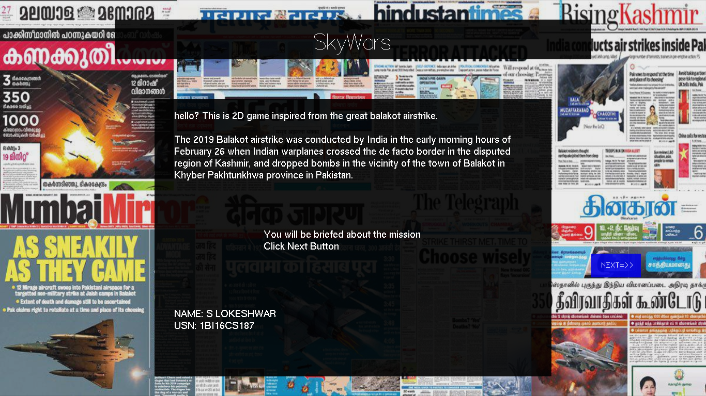
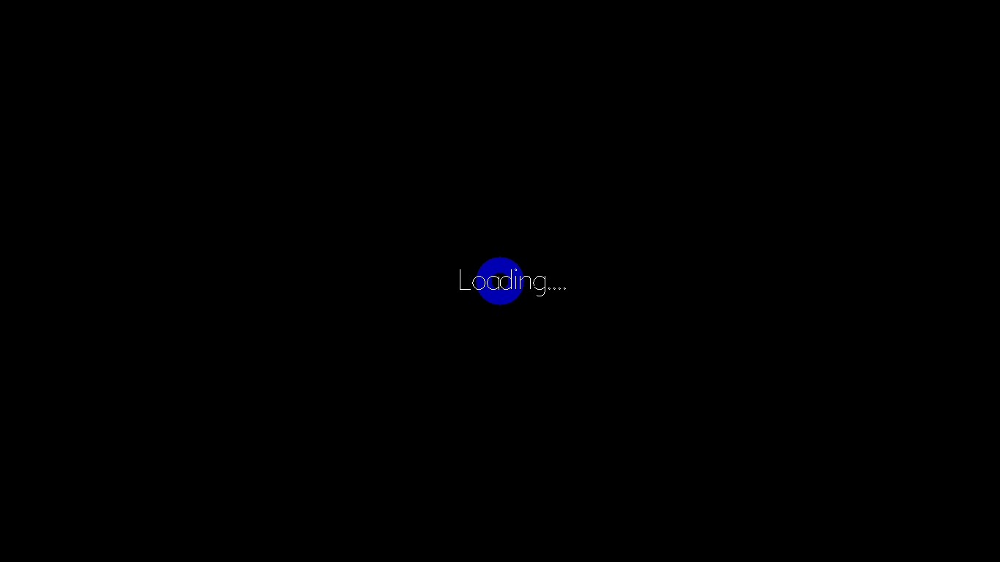
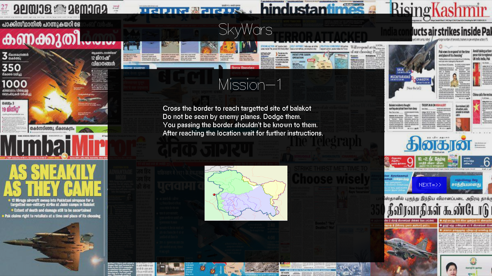
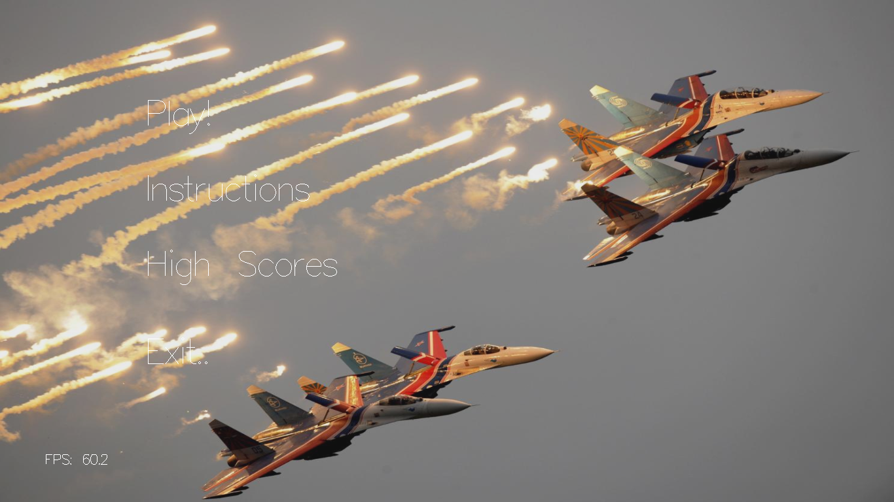
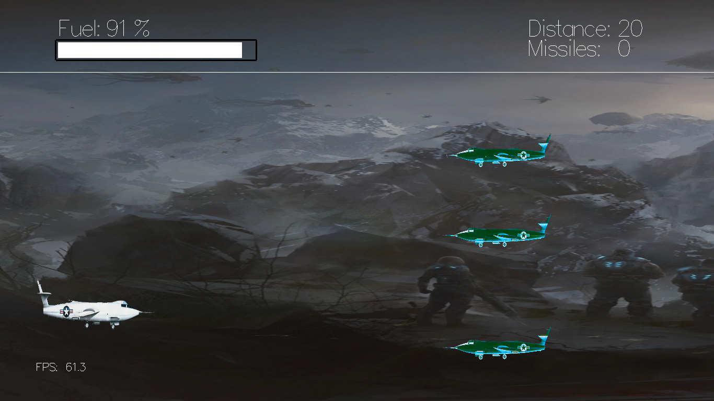
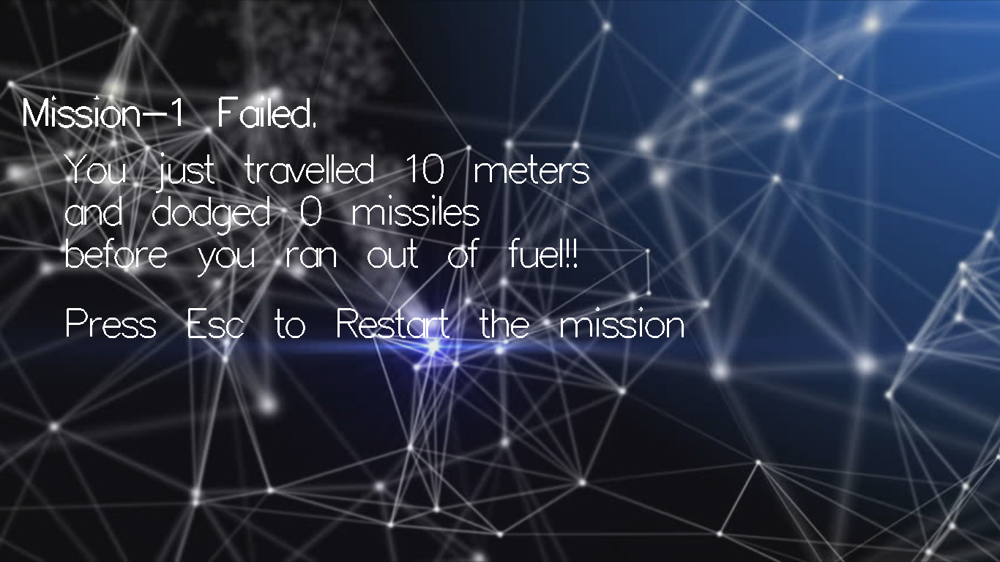
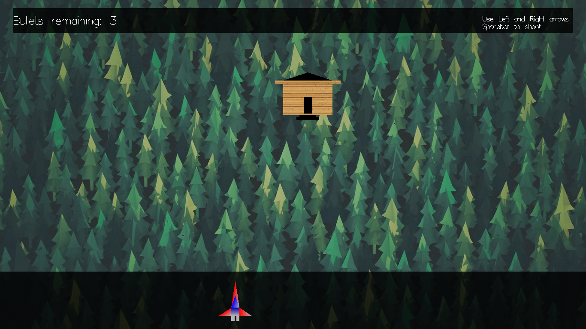
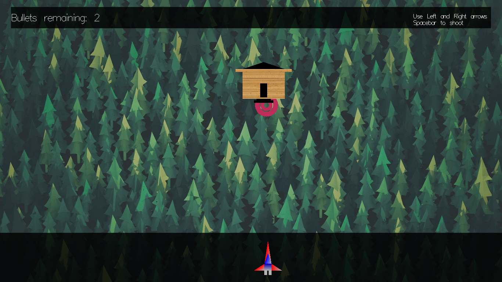
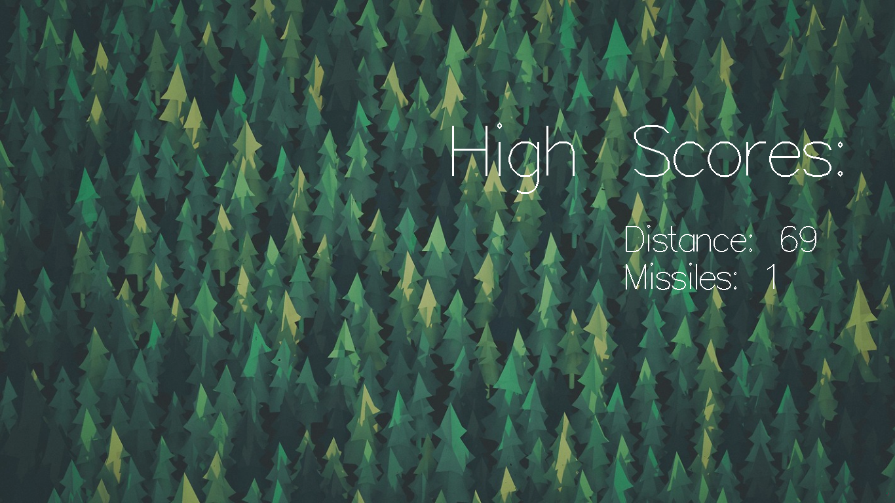

# Plane_CG

Using SOIL.
Preferred installation on Ubuntu.
install 
g++
cc
opengl

Load SOIL libraries present in src folder
using:
sudo apt-get install libsoil-dev
then compile using:
g++ -g source.cpp -lglu32 -lSOIL -lopengl32 -lfreeglut

Description of Flow:

Step 1: Compile the program using cpp compiler linking GLUT, GL, GLU,	SOIL. Then run the same.

Step 2: You will be greeted with a loading screen followed by the project	introduction. Click next to go to next step

Step 3: A mission-1 Briefing will be given. Click next to go to next step.

Step 4: You will be shown the main menu for the game.
•	Choosing play will take you step-5.
•	Choosing instruction will take you to step-11.
•	Choosing instruction will take you to step-12.
•	Choosing exit option will terminate the program.

Step 5: The game play for mission-1 starts. 

Step 6: If mission-1 is completed, displays mission-1 completed Screen go to
  step-7. Else If mission-1 is not completed, displays mission-1 not	
  completed Screen go to step-4.

Step 7: Mission-2 briefing is given. Click next when ready to go to step-9.

Step 8: The game play for mission-2 starts.

Step 9: If mission-2 is completed, displays mission-2 completed screen, Go to	
  step-10. Else displays mission-2 not completed Screen go to step-4.

Step 10: Display mission-2 completed screen. Go to step-4.

Step 11: Display Instructions of the game play. Press esc to go back to step-4.

Step 12: Display High Score of the game play. Press esc to go back to step-4.

FUTURE ENHANCEMENT 
 In future the same project can be enhanced in such a way that we can interact more with the project. We can add new features to change plane models and scenes. New type of bombs can also be added. 
A vast amount of future work can be possible by following investigations and strategies. More features can be included and can be modified in a more versatile way such that we can let the players shoot enemy planes during mission-1 itself.

ScreenShots:

